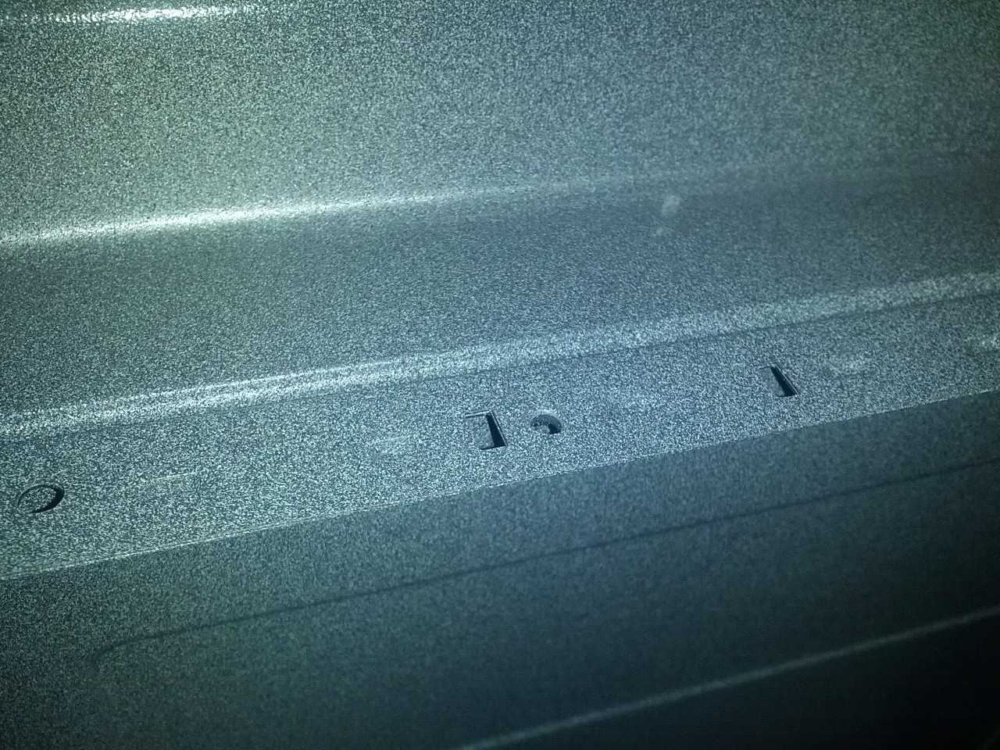
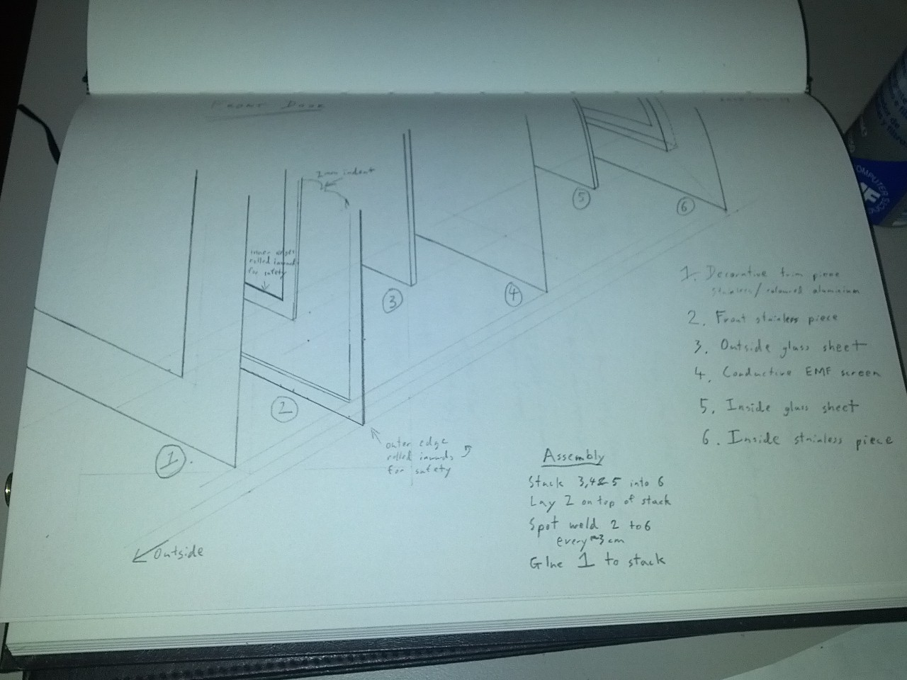

### Designing a door

Designing the door to the microwave is turning out to be a bit more fiddly than I hoped. This is a combination of mechanicals being new to me and regulatory concerns about keeping the dangerous radiation in the box.

The criteria isn't too complex, discovering that non-Australian standards are a touch more expansive was an unpleasant surprise though:

<ol>
<li>Must open to allow foods in and out.</li>
<li>Must comply with Aus, US &amp; EU standards.
<ul>
<li>Must provide RF seal when shut (no cooking bystanders).</li>
<li>Must have double interlock to prevent operation when open.</li>
<li>Must be durable and maintain seal through lifespan.</li>
</ul>
</li>
<li>Must indicate when sealed to allow operation.</li>
<li>Must provide mechanism to open/lock.</li>
<li>Should allow viewing of food.</li>
</ol>

### Standards

I was a bit annoyed to discover the <a href="http://www.accessdata.fda.gov/scripts/cdrh/cfdocs/cfcfr/CFRSearch.cfm?CFRPart=1030&amp;showFR=1">US FDA standard Part 1030</a> in working through the door design. The Australian microwave standards simply specify a maximum allowed external radiation level. The US standards cover the radiation level, door interlocks and also mandate the presence of a user manual, service manual and a pair of warning stickers. The EU standards further proscribe durability tests.

According to a <a href="http://electronics.stackexchange.com/questions/148544/kickstarter-electronics-and-local-regulations/148550#148550">completely reputable source</a> I actually only have to comply with the Australian regulations, if I ship a product to the US then the person buying it is considered the importer and are responsible for the local compliance. This is a touch dodgy, even for me. My plan is to comply and certify with the relevant Australian, US and EU (IEC) standards for a domestic microwave. As most countries have formally harmonized with the IEC standard or based their standard off the US or Europe standards I should actually comply with basically everyone worldwide. I am not going to pay for hundreds of certification marks and the documentation required to make it formal though.

#### Radiation leakage

All the standards specify limits on radiation leakage. During operation a radiation detector is moved around 5cm from the unit and the level must not exceed 1mW/cm². The areas of concern are any holes in the cavity like air holes or the front viewing panel, any seams to ensure they are welded correctly and my biggest concern is the edge around the sides of the door.

Deliberate holes are the easiest issue to handle. Radiation has a wavelength, for a microwave oven this is roughly 120mm. You can do complex maths around radiation holes by treating them as waveguides but it basically boils down to a 120mm wave needs a 120mm hole. As the hole gets smaller than 120mm you get an exponential drop in the radiation slipping through. Often a hole less than 1/4 or 1/10th of the wavelength is approximated as having zero transmission. My Panasonic microwave has holes of 1mm at the front, 2mm on the top and 3mm on the side, all less than 1/40th of the wavelength. I think the small holes are preferred by the manufacturers for their strength rather than due to radiation concerns.

The microwave radiation cavity is going to be made of several sheets of metal welded together. As radiation can slip out a narrow slit just as happily as a gaping hole care has to be taken at the joins to prevent this. My victim microwaves both put a dent in just before the join to block the radiation from reaching the slit. The spot welds they used also seem to involve indentation which would assist in breaking up any slit, the welds are spaced every 22mm. Dents like that are a bit harder with my manufacturing techniques but are possible, I think this one can be solved in consultation with the manufacturer and a little bit of testing.

<!-- TODO: Show 310px width, show or format caption -->

Panasonic's RF safe welding join

The most concerning issue is the edges of the door. These are nice big slits, just perfect for radiation to spew out of. Looking at the Samsung microwave I think the way this is generally solved is very sneaky and clever. They haven't followed the obvious solution of trying to create a tight seal, with the Samsung microwave door shut I can see light from a torch shining through, a piece of paper moves without resistance. However if you look closely the aluminium outer frame of the microwave overlaps the door by a few mm. I've checked and found this in three microwaves, all different brands. I think what is happening is that the aluminium lip catches the radiation that slips out and limits the amount that gets through. The lip isn't present on the bottom, so I think they have been differently sneaky there. For the testing of the device it would be reasonable to assume it would be placed a horizontal surface, the manual probably specifies this as the standard operating condition. This position would prevent the detection device being placed 5cm below the microwave door, compliance achieved, problem solved.

#### Door Interlocks

An interlock is a switch which prevents operation of a device when it is open. For example robots often have a proximity sensor or gate, get too close and the robot immediately shuts down. A common example of this is the automated airport bag drop systems, if you are too close to your bag the conveyor will shut down. Given that a microwave is a touch dangerous it is only sensible that we employ an interlock to prevent operation when the door is open. However US standards require that we take this a fair bit further.

The <a href="http://www.accessdata.fda.gov/scripts/cdrh/cfdocs/cfcfr/CFRSearch.cfm?CFRPart=1030&amp;showFR=1">US Federal Regulations</a> are very specific about what safety interlock must be employed and that special provision must be taken to prevent them from being disabled. Being able to disable an interlock is often a desired feature, the thinking is that if you want to deliberately bypass the safeties then you have chosen to accept the risk and know what you are doing. I assume somebody in the US disabled the interlock on their microwave and got fried, personally I feel they achieved their desired outcome but the regulator obviously felt differently.

The regulations aren't easy to read, it comes down to <a href="https://books.google.com.au/books?id=zJAFv6MrcAgC&amp;lpg=PA116&amp;pg=PA117#v=onepage&amp;q&amp;f=false">this example circuit</a>. Modern microwaves have tweaked it slightly but all follow roughly this pattern. You have three switches, your primary interlock which shuts off power to the system, your secondary or monitor interlock which shorts the unpowered system and a sense switch for the control logic. The combination of these two interlocks means that if either one of them fails or is disabled then the short circuit causes the fuse to blow, as these are small mechanical components this is a common microwave failure point.

There are additional restrictions however, the primary interlock must be designed such that it cannot be deliberately disabled. Specifically a mechanical interlock must be concealed such that it can't be poked by any body part or straight object, a magnetic interlock can't be tripped by sticking a magnet against the body of the microwave. Also the primary and monitor interlocks must be mechanically and electrically distinct. The ubiquitous double hook design that every microwave uses makes far more sense with this understanding. A hook is required to meet the concealed requirement and two hooks are required to keep things distinct.

There are opportunities to vary the double hook pattern however. A single hook could be used for the primary interlock with an alternative method used for the other switches. A flexible stick would also meet the criteria if it was guided into a bend. My preference though is for a non-mechanical switch, something more elegant to contrast against the clunky nature of a door. Fortunately <a href="https://en.wikipedia.org/wiki/Proximity_sensor">there are lots of options</a>. I am leaning towards a magnet despite the restrictions imposed by the standard, I think with a non-magnetic chassis I should be ok as it won't self-support and there are other ways to skin the cat such as <a href="https://en.wikipedia.org/wiki/Programmable_magnet">coded magnets</a>.

#### Durability

The European/International standard is IEC 60335-2-25 ed6.1. I can't actually find a copy of the document so I <a href="http://webstore.iec.ch/webstore/webstore.nsf/ArtNum_PK/49972!openDocument">might have to buy it</a>. However from the public documentation you can see that it contains the restrictions in the US regulations, with some slight variation, and some additional durability tests. I have found <a href="http://kidcateringequipment.com/docs/menumaster/info/comparison--between-standards-for-domestic-and-commercial-microwave-ovens.pdf">a brief writeup of the durability tests</a> and the news isn't good. I don't think passing the tests will be difficult, just need decent hinges. However getting the test house to open and shut the door 100,000 times is going to be expensive. Assuming one second to open the door and one second to close it, that is 56 hours of continuous testing using their 6-DOF robot. The other tests will take another day, this has probably just doubled my testing expenses. I'll build a basic push/pull robot for my pretesting which could be fun.

### Options

Understanding the criteria I now have to design a door. 
There are several obvious options, each with their own drawbacks.

<b>I can design a clone of the standard door and make my own.</b> Starting with this one to get it out of the way. The cost of doing this makes it a non-starter. I spoke to the very helpful staff at SK Plastic to understand the costs around injection molding. To build the latch for a microwave door would probably cost roughly $10k-15k for the tool, $1 per part and some other costs for the design and run start etc. At my pricing quantity of 500 units the latch alone would come to roughly $26. The cost of the other larger plastic parts would be higher and the metal screen would either have to be stamped (at least another $10k tooling) or every hold punched individually (several dollars per sheet).

<b>I can buy a door.</b> All the doors are the same, so there is obviously a few companies making these doors. A logical option would be to buy an existing door, either whole or in parts. For example <a href="http://topradar.en.alibaba.com/product/684966786-215045489/Microwave_Oven_Parts_Microwave_door_latch_door_hock.html">Alibaba has manufacturers offering the door latch</a>, I haven't enquired as to the price but expect it would be well under $1 per unit. Going half way down this path is difficult, the standard latch means I have to use the matching catches and microswitches with the related durability issues. The latch also dictates the thickness of the door, which pushes again towards plastics as metal would be very heavy. Buying existing outer plastics would result in the microwave having the same appearance as every other microwave, probably looking like the cheap end of the spectrum as that is what is available. Vacuum formed plastic is probably within my price envelope as the setup costs aren't too bad, I am wary about a heat sensitive plastic in a microwave but apparently PET and HDPE can work.

<b>I can design something new.</b> The big risk here is falling prey to not-invented-here syndrome and a belief that I my design skills are superior to all the major manufacturers combined. However this entire exercise is essentially predicated on that case so I'll just move on. Doing this will allow me to differentiate the product in a way that is obvious to anyone interacting with it. It will add time and cost to put it all together.

Going forward my plan A is going to be to design from scratch, plan B is to buy in components. Getting half way through a scratch design and then buying in parts where required would probably be a reasonable compromise outcome so blundering forward on my own isn't a total loss.

### Draft design

The modern microwave is almost entirely injection molded plastic and stamped steel, both techniques require mass production I can't rely on. My manufacturing is primarily orientated around bending sheet metal and for the door, glass.

The preliminary design is for a metal and glass sandwich, in my head it is rather elegant. The layers to the sandwich are a metal inner frame, glass plate, metal RF mesh, glass plate, metal outer frame, some trim. Each glass sheet is 2mm thick, the metal 1mm thick and the RF shield 1mm, so the total thickness is just 7mm compared to my Samsung's 30mm. Being thin won't just look awesome, it also helps keep my weight down.

As bonus features I should also be able to get the door to open almost 180 degrees and be able to support left handed doors.

I have envisaged that the sandwich will be assembled and then the two metal sheets spot welded to seal the glass in. Then a trim piece of metal glued on to cover the spot welds and pretty it up.

I am yet to settle on the hinges, latch or interlock mechanisms. At the moment I am thinking of them as accessorising for the door. Realistically some trial and error is going to be required for all three of these areas.

<!-- TODO: Show 310px width, show or format caption -->

Pencil sketch of door sandwich

### RF Shield

Every microwave I have seen has a solid metal sheet in the front window with circular holes stamped in it. The two microwaves I have measured both have holes roughly 1mm in size. As discussed earlier this is 1/120th of the wavelength and excessively cautious, internal air vent holes are 3mm for example. The pattern is a tradeoff between minimising the metal between the holes, structural strength and ease of cleaning. I think with my door structure the tradeoff isn't required so I can better optimise the visibility.

A typical guideline for RF shielding is 1/4 of the wavelength allowing holes up to 3cm. Because it is easier to buy I am going to use a square hole, radiation is sneaky and can sneak out on the diagonal so to maintain 1/4 wavelength the square hole must be smaller than 21x21mm.

A wire mesh at 20x20mm is a fairly cheap option and at roughly 75% open area provides better visibility than the existing microwaves. The RF performance will be worse than the existing standard due to the increased hole size and decreased thickness however I think it should be within spec, testing will confirm this before the design is finalised.

Potential suppliers:

* <a href="http://www.lessemf.com/fabric.html#1246">LessEMF.com</a>
* <a href="http://www.metalmesh.com.au/stainless-steel-mesh">Metal Mesh</a>
* <a href="http://www.meshdirect.co.uk/wire-mesh-20mm-x-20mm-16g.html">Mesh Direct</a>

If I had sufficient quantity what I really want to do is have a piece of glass manufactured with the metal screen built into the glass. This would significantly reduce complexity by removing the layers and the glass would protect the screen from damage. However doing this would require a special manufacturing rig with associated costs that can only be recovered with large quantities.

### Latch

Once closed the door has to stay closed until it is deliberately opened. I have a strong preference for a latch that releases by being pulled on, the push button to open design feels clumsy to me. Again we have options :)

<b>A hook latch</b> is standard in microwaves. The hook is on the door and hooks into a static hole on the body of the microwave. A spring on the hook keeps it closed until delibrately opened. A slope on the back of the hook allows it to be shut while closed, the hook slides up the latch until it is over then pulls shut. There are two common opening mechanisms, the standard push button works by physically pushing against the hook to raise and released it. The doors you can simply pull open have an oval shaped hook, basically a slope on the inside of the hook allows it to be pulled out much like it is pushed in.

<b>Gravity</b> is an interesting option. By making the door on an angle I can have it naturally sit in the closed position but little force would be required to open it again. This would be cheap but have the downsides of not looking sturdy and not working if the microwave wasn't flat. Pairing this with a top opening door might work.

<b>Spring loaded hinge</b> is an easy solution. Putting springs into hinge mechanisms is fairly common practice for auto-closing doors, gates or cupboards. The spring hinge can be fitted without much additional work and allows easy operation. I don't know if an autoclosing door is an advantage or disadvantage.

<b>Magnets</b> are awesome. Magnets are also a possible door latch mechanism, the common stainless steel isn't magnetic so I would do this by putting a magnet in both the door and body of the microwave. The magnet would help close the door if it was almost closed and keep it closed until tugged open. Best of all I should be able to hide them so it just happens magically.

### Closed detection

Both my victim microwaves have three microswitches that get hit by the latch when the door is closed. Two of these are used to implement the standards required interlock system, the third is a low voltage signal to the control circuitry.

The standards require that there be at least two independent detection devices, one of which must be tamper resistant.

Again, there are multiple options.

<b>A hook latch</b> paired with microswitches like every other microwave. Rather boring though.

<b>Directly pushing a microswitch</b> stuck on the surface, probably hiding under a plastic film for cleaning. This is simple, nothing is required on the door and contact is measure directly. It doesn't meet the tamper resistant requirements but is suitable for a secondary switch.

<b>Magnetic proximity detection</b> works by mounting a permanent magnet on the door and then looking for it. For this to be tamper resistant it can't be triggered by placing a magnet on the microwave, I think this is free because a stainless steel body shouldn't be magnetic. This couples nicely with a magnetic closing mechanism.

<b>Light gate detection</b> much like a shop uses a light beam and mirror I can do the same. Requiring a mirror to be mounted on the door fulfills the primary switch requirements. I can probably use polished steel which would be reflective enough to achieve this and with a tiny hole on the body it would be sufficiently magic to be awesome. The downside is that any food or grime that block the mirror would prevent the switch from closing. And being fairly magic like it wouldn't be obvious which bit of grime was the problem.

<b>A rotation sensor</b> positioned in the hinge would also work. This would complicate the hinge area a bit but would meet all the requirements for the primary switch. One could be placed on the top and bottom to get two independent controls. This would require a microchip for each sensor (ATTiny &#8211; yay!) to read the value and control a high voltage relay but we are still in the few dollars price range.

